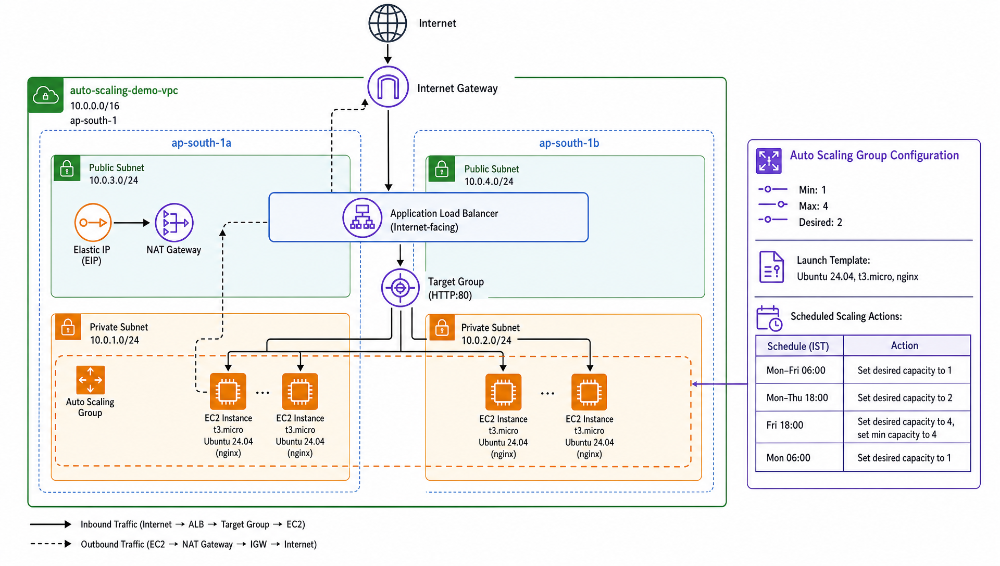

# AWS EC2 Auto Scaling Setup

## Problem Description

A single server hosts a service 24/7. Nighttime traffic regularly increases and causes the server to become overloaded and crash. Daytime (morning) traffic is very low, so the always-on server wastes resources and cost. Weekly traffic surges every Saturday are much larger and consistently overwhelm the server. 

## Solution Description

Instead of running a single server at all times, we run one server during weekday mornings (Monday to Friday - 6 am to 6 pm), 2 servers during weekday nights (Monday to Thursday - 6 pm to next day morning 6 am), 4 servers during weekends (Friday 6 pm to Monday 6 am).

## Architecture Diagram

## Architecture Description

This project provisions a highly available web server setup on AWS (ap-south-1) using Auto Scaling behind an Application Load Balancer, spread across two Availability Zones.

### Network Layout

- **VPC** - `10.0.0.0/16`
- **Internet Gateway** - entry point for inbound internet traffic, attached to the VPC
- **Public Subnets** - `10.0.3.0/24` (ap-south-1a), `10.0.4.0/24` (ap-south-1b) - host the ALB, which receives traffic from the Internet Gateway and distributes it to EC2 instances via the Target Group
- **Private Subnets** - `10.0.1.0/24` (ap-south-1a), `10.0.2.0/24` (ap-south-1b) - host the EC2 instances, which are not directly reachable from the internet
- **NAT Gateway** - sits in the public subnet of ap-south-1a with an Elastic IP, allowing EC2 instances in private subnets to initiate outbound connections (e.g. package updates) without being publicly reachable

### Compute

- **Launch Template** - Ubuntu 24.04 LTS (Noble), t3.micro, nginx installed and enabled via user data
- **Auto Scaling Group** - min 1, max 4, desired 2 by default, spread across both private subnets, registered to the ALB Target Group

### Scheduled Scaling

The ASG capacity is adjusted automatically on a schedule (all times IST):

| Schedule        | Time (IST)     | Min | Desired | Max |
|-----------------|----------------|-----|---------|-----|
| Weekday morning | Mon-Fri 06:00  | 1   | 1       | 4   |
| Weekday evening | Mon-Thu 18:00  | 1   | 2       | 4   |
| Weekend start   | Fri 18:00      | 4   | 4       | 4   |
| Weekend end     | Mon 06:00      | 1   | 1       | 4   |

## Iac Source Code

See inside `aws-infrastructure/`

## Steps to run

1. `cd aws-infrastructure`
2. (Create `.env` file with AWS credentials)
3. `terraform init`
4. `terraform plan -out=plan.tfplan`
5. `terraform apply plan.tfplan`

To destroy

1. `terraform destroy`

## Internship Details

- Intern ID: `CITS752`
- Name: Shoban Chiddarth
- No. of weeks: 4
- Project Name: AWS Static Website Hosting
- Project Scope: Cloud Computing
